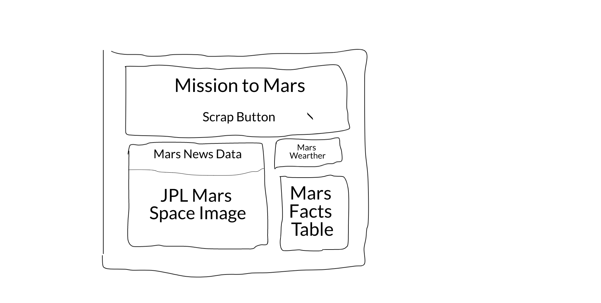
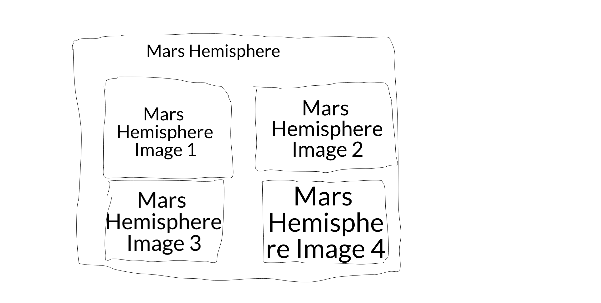

# All-About-Mars

Project scrapes various websites about Mars and creates a web Application to display the data scrapped. The data is also stored in MongoDb database. Aim to build a web application that scrapes the following websites - 

**NASA Mars News - https://mars.nasa.gov/news/**

**JPL Mars Space Images - https://www.jpl.nasa.gov/spaceimages/?search=&category=Mars**

**Mars Weather - https://twitter.com/marswxreport?lang=en**

**Mars Facts - https://space-facts.com/mars/**

**Mars Hemisphere - https://astrogeology.usgs.gov/search/results?q=hemisphere+enhanced&k1=target&v1=Mars**

The Project creates a webpage displaying data scraped from these websites in the following layout - 
The index.html will take the scrapped data as a arameter and build each element separately on the webpage.

### Page 1

### Page2

## DataBase - 

Project stores the data into Local Mono Database. 
<pre>
MongoDB - 
Database :mars_db
Collection : mars_info
</pre>

To run the webpage - 

* Download(clone) the Project
* Run app.py
* Now open https:////localhost:27017
* You will see the main page. Click the "Scrape" button.
* Wait 2 mins
* The scrapping will be executed and final Webpage for Mission to Mars will be displayed(Similar to Page 1 & 2 Mock up above).

## Flask App
Python based web app to scrape Mars data and display to a webpage. Also store it to a local database. 
The app has two routes - 

<pre>
/
</pre>

 Main page. Has no data other than the title and Scrap button. 
  
 <pre>
/scrape
</pre>

 Scraps the five web pages to build a dictionary. Stores the data into a local MongoDB database. Displays the data scraped into the webpage. Th route will call another python script which does the scrapping and build the entire data into a dictionary.

